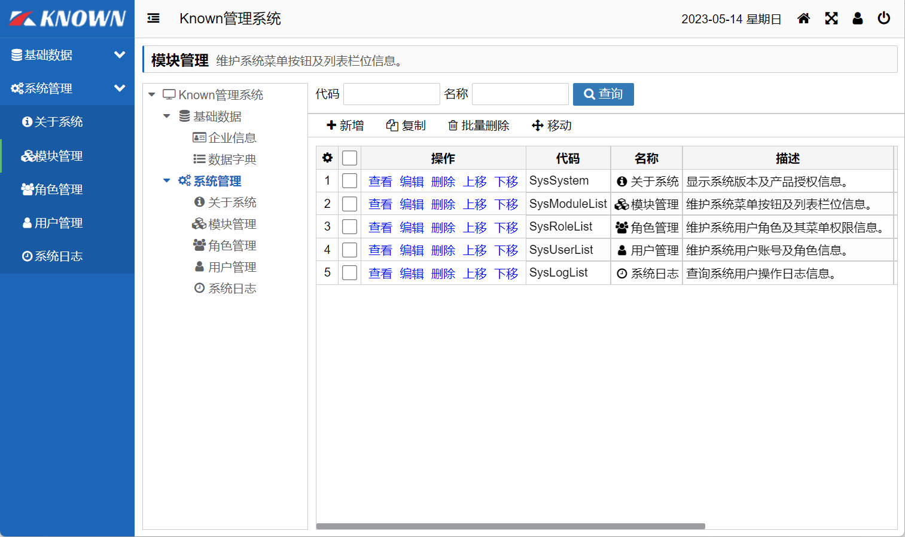
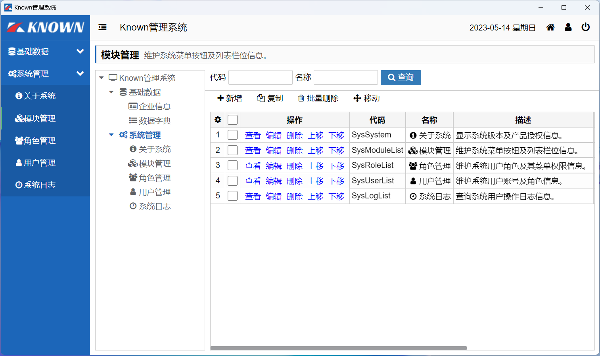

# Known

Known是基于C#和Blazor开发的前后端分离快速开发框架，开箱即用，跨平台，一处代码，多处运行。

[](https://gitee.com/known/Known/stargazers)
[](https://gitee.com/known/Known/members)
[](https://gitee.com/known/Known/blob/master/LICENSE)


### 概述
* 基于C#和Blazor实现的快速开发框架，前后端分离，开箱即用。
* 跨平台，单页应用，混合桌面应用，Web和桌面共享一处代码。
* 包含模块、字典、组织、角色、用户、日志、消息、工作流、定时任务等功能。
* 代码简洁、易扩展，让开发更简单、更快捷！

> 如果对您有帮助，点击右上角⭐Star⭐关注 ，感谢支持开源！

### 框架结构
```
├─Known         ->框架前后端共用库，前后端数据交互模型。
├─Known.Core    ->框架后端库，通用业务逻辑。
├─Known.Razor   ->框架前端库，Grid、Tree、Form等Blazor组件。
├─Known.Studio  ->框架代码生成工具。
├─Known.Test    ->框架测试程序。
```

### 主要功能

* 模块管理：配置系统功能模块、操作按钮、列表栏位，供开发者使用。
* 数据字典：维护系统各模块下拉框数据源。
* 租户管理：维护平台租户信息，用户数和单据数限制。
* 组织架构：维护企业组织架构信息，树形结构。
* 角色管理：维护系统角色及权限信息，权限可控制菜单，按钮，列表栏位。
* 用户管理：维护系统登录用户信息。
* 系统日志：查询系统用户登录和访问菜单等日志，可用于统计用户常用功能。
* 消息管理：系统内消息提醒，工作流消息通知。
* 流程管理：系统内置工作流引擎，提供提交、撤回、分配、审核、重启操作。
* 定时任务：导入和计算耗时的功能采用定时任务异步执行。

### 快速安装
```
--安装模板
dotnet new install KnownTemplate
--创建项目
dotnet new known --name=你的项目
```

### 生态系统
- [项目模板](https://gitee.com/known/known-template)
- [开发示例](https://gitee.com/known/known-sample)

### 效果图

Web效果图|桌面效果图
:--:|:--:
|

### 使用教程

* [Wiki教程](https://gitee.com/known/Known/wikis/pages)

### 更新日志

* [更新日志](Document/更新日志.md)
