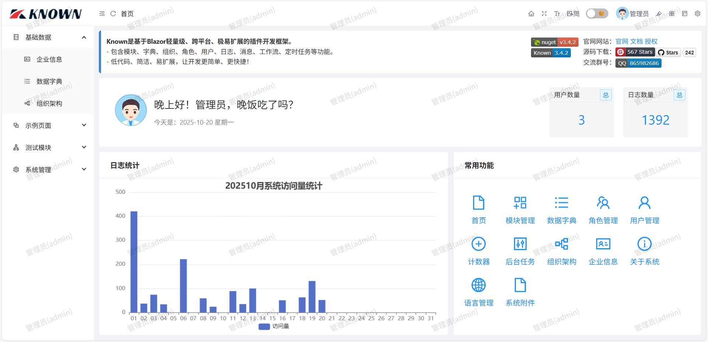
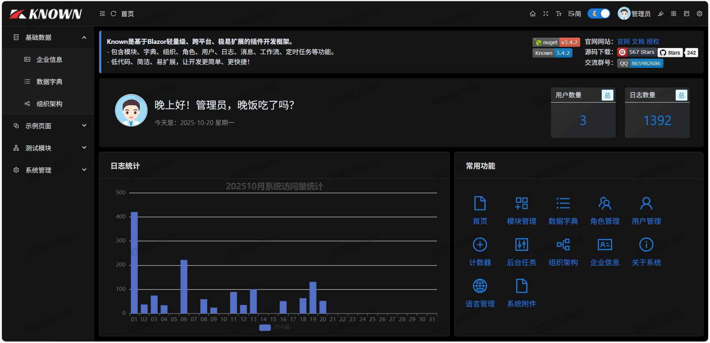

<center>


`Known`是基于`Blazor`轻量级、跨平台、极易扩展的插件开发框架。

[](https://gitee.com/known/Known/stargazers)
[](https://github.com/known/Known)
[](https://gitee.com/known/Known/blob/master/LICENSE)
[](https://www.nuget.org/packages/Known)
[](https://www.nuget.org/packages/Known)


</center>

- 官网：[https://known.org.cn](https://known.org.cn)
- 源码：[https://gitee.com/known/Known](https://gitee.com/known/Known)
- 源码：[https://github.com/known/Known](https://github.com/known/Known)

### 项目特性

- 插件开发：基于`Blazor`实现，轻量级、跨平台、极易扩展的插件开发。
- 通用权限：内置通用权限模块，基于角色鉴权，`URL`检查，只需专注业务功能。
- 最佳实践：低代码开发，一人多角色，沟通高效，进度快，无前后端沟通成本。
- 国际化：提供完备的国际化多语言解决方案，默认支持简体中文。
- 现代`UI`：基于`Ant Design`设计风格的现代`UI`展现层，易扩展。
- `C#`语言：全量使用C#语言进行全栈开发，从前端到后端只需学习一门语言。


### 项目结构

```
├─Known           -> 框架核心类库，定义统一的对象模型、接口、组件和扩展，内置权限、微信、工作流。
├─Plugins         -> 插件项目文件夹
| ├─Known.Core    -> 基于Asp.Net Core的服务端插件。
| ├─Known.Cells   -> 基于Aspose.Cells实现的Excel插件。
| ├─Known.Sample  -> 示例模块插件。
├─Known.Server    -> 框架示例（Server模式）。
├─Known.Wasm      -> 框架示例（Auto模式前端）。
├─Known.WasmHost  -> 框架示例（Auto模式后端）。
├─Known.WinForm   -> 框架示例（WinForm）。
├─Known.Maui      -> 框架示例（MAUI）。
├─Known.Photino   -> 框架示例（Photino.NET）。
├─Known.sln       -> 解决方案文件。
```

### 项目链接

- `KnownDB`：[https://gitee.com/known/KnownDB](https://gitee.com/known/KnownDB)
- `JxcLite`：[https://gitee.com/known/JxcLite](https://gitee.com/known/JxcLite)
- `KnownCMS`：[https://gitee.com/known/KnownCMS](https://gitee.com/known/KnownCMS)

### 界面截图




### 捐赠支持

> 如果你觉得这个框架对你有帮助，你可以请作者喝杯咖啡表示鼓励 ☕️

